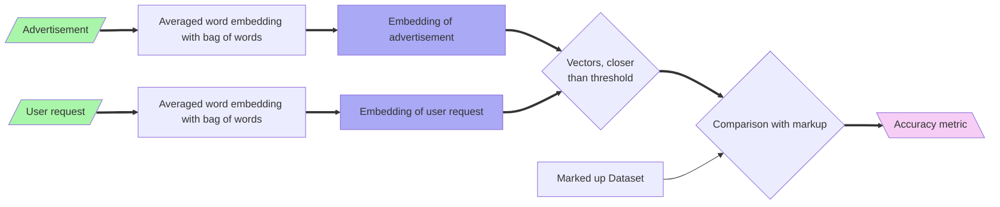

# System Design

This is a main design document to document design principles, system architecture, performed investigations, and motivations for decisions.

## Problem Statement

There is a set of advertisements in Russian (and partially English) language, which should be searcheable by user text request. The request can coincide with the advertisement only partially.

### Main Challenges

1. Request can contain too many details, which are absent in the advertisement, but not necessarily absent in the advertised product
1. Request can contain description of general product category, but not the description of category instances
1. Request and advertisement can contain misprints, punctuation and grammar errors, unexpected abbreviations, toponyms, etc.
1. Request can be written only as explanation to the image, without description of main product properties
1. Advertisement can tell not only about selling or giving, but also about buying or acceping
1. It is desirable to distingush proposals without any price from the proposals with price

## Review of Text Processing Tools

### Text Preprocessing

### Word Embeddings

#### Word2Vec
    
| Library                                                            | Licence  | Languages   | Models                                                                               | Model Licences | OOV | Comment                                    |
|--------------------------------------------------------------------|----------|-------------|--------------------------------------------------------------------------------------|----------------|-----|--------------------------------------------|
| [gensim](https://radimrehurek.com/gensim/auto_examples/index.html) | LGPL-2.1 | rus eng | "word2vec-ruscorpora-300"   "word2vec-google-news-300"                               | CC-BY    ? | no  | rus - with POS-tags                        |
| [flair](https://flairnlp.github.io/docs/intro)                     | MIT      | rus eng | [ruwikiruscorpora_upos_cbow_300_10_2021](https://rusvectores.org/ru/models/)    ? | CC-BY    ? | no  | only text format,   tokenizes POS-tags | 

#### FastText

#### GloVe

| Library                                                            | Licence  | Languages   | Models                                                                               | Model Licences | OOV | Comment                                    |
|--------------------------------------------------------------------|----------|-------------|--------------------------------------------------------------------------------------|----------------|-----|--------------------------------------------|
| [SpaCy](https://spacy.io/usage/models#quickstart) | MIT | rus eng | "ru_core_news_sm"   "ru_core_news_md"    "ru_core_news_lg"                             | MIT | in md / lg models have vector vocabulary support  | Tokenization,   POS Tagging,    Lemmatization,   Named Entity Recognition,     Similarity                 |

## Data Format

* `ads_db.txt` - plain text file with one advertisement per line (multiline advertisements are normalized to a single line with `\n`)
   * ID of advertisement is its line number (counted from 1), so to keep old IDs, new requests must be added below
* `request_db.txt` - plain text file with one search request per line
   * ID of request is its line number (counted from 1), so to keep old IDs, new requests must be added below
* `matching_db.txt` - matching file for requests and advertisements:
   * Each line contains matching info in a form like `1, 2, 4, 10 - 4, 10, 11, 18, 20`, where _before the dash_ comma-separated request IDs are placed, and comma-separated advertisement IDs are placed _after the dash_
   * Comma-separated IDs is just a syntactic sugar, they can be equivalently written as `1 - 4`, `2 - 4`, `4 - 4`, `10 - 4`, `1 - 10`, and so on
   * IDs that were not mentioned in the matching file accounted as not matched

No suitable data annotators were found after the quick search, so data is annotated manually in plain text file.

## Tried Architectures

### Averaged Word Embedding in BOW

## Architecture Decisions

### No Data in Repository

Since real advertisements can contain personal information, we don't store them in the repository. Generally, we decided to not store any data in the repository at all, and work with it locally with [DVC](https://dvc.org/).
