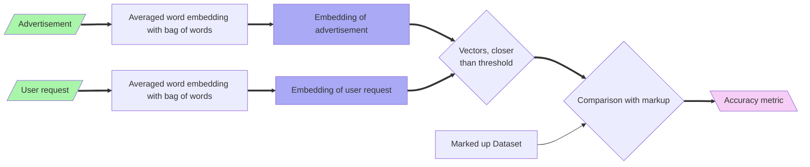

# System Design

This is a main design document to document design principles, system architecture, performed investigations, and motivations for decisions.

## Problem Statement

There is a set of advertisements in Russian (and partially English) language, which should be searcheable by user text request. The request can coincide with the advertisement only partially.

### Main Challenges

1. Request can contain too many details, which are absent in the advertisement, but not necessarily absent in the advertised product
1. Request can contain description of general product category, but not the description of category instances
1. Request and advertisement can contain misprints, punctuation and grammar errors, unexpected abbreviations, toponyms, etc.
1. Request can be written only as explanation to the image, without description of main product properties
1. Advertisement can tell not only about selling or giving, but also about buying or acceping
1. It is desirable to distingush proposals without any price from the proposals with price

## Review of Text Processing Tools

### Text Preprocessing

To be organized into tables

[flair](https://flairnlp.github.io/docs/intro) has: 
* POS-tagging (multilingual - check rus), 
* NER (multilingual - check rus)
* more

[SpaCy](https://spacy.io/usage/models#quickstart) has:
* Tokenization
* POS Tagging
* Lemmatization
* Named Entity Recognition

### Word Embeddings

#### Word2Vec
    
| Library                                                            | Licence  | Languages   | Models                                                                               | Model Licences | OOV | Comment                                    |
|--------------------------------------------------------------------|----------|-------------|--------------------------------------------------------------------------------------|----------------|-----|--------------------------------------------|
| [gensim](https://radimrehurek.com/gensim/auto_examples/index.html) | LGPL-2.1 | rus eng | "word2vec-ruscorpora-300"   "word2vec-google-news-300"                               | CC-BY    ? | No  | rus - with POS-tags                        |
| [flair](https://flairnlp.github.io/docs/intro)                     | MIT      | rus eng | [ruwikiruscorpora_upos_cbow_300_10_2021](https://rusvectores.org/ru/models/)    ? | CC-BY    ? | No  | Only text format,   Tokenizes POS-tags | 

#### FastText
| Library                                              | Licence  | Languages   | Models                                     | Model Licences            | OOV | Comment                                                                   |
|------------------------------------------------------|----------|-------------|--------------------------------------------|---------------------------|-----|---------------------------------------------------------------------------|
| [FastText](https://fasttext.cc/docs/en/support.html) | MIT | rus eng | "ru"   "en"                            | CC BY-SA 3.0              | Yes | Subword tokenization,   Sentence vectorization                        |
| [flair](https://flairnlp.github.io/docs/intro)                     | MIT      | rus eng | "ru"   "en"   or [fasttext original](https://fasttext.cc/docs/en/crawl-vectors.html) | MIT   or CC BY-SA 3.0 | Yes | Fully trough `FastTextEmbeddings`, which is deprecated since version 0.14 | 

#### GloVe

| Library                                                            | Licence  | Languages   | Models                                                                                      | Model Licences | OOV | Comment                                                                                                                                                            |
|--------------------------------------------------------------------|----------|-------------|---------------------------------------------------------------------------------------------|----------------|-----|--------------------------------------------------------------------------------------------------------------------------------------------------------------------|
| [SpaCy](https://spacy.io/usage/models#quickstart) | MIT | rus eng | "ru_core_news_md"    "ru_core_news_lg"   "en_core_news_md"    "en_core_news_lg" | MIT | No  | Only "md" / "lg" models have vector vocabulary support (see first important note [here](https://spacy.io/usage/linguistic-features#vectors-similarity)  Similarity |

## Data Format

All data is located in `data/` directory and [is tracked separately](#no-data-in-repository).

* `ads_db.txt` - plain text file with one advertisement per line (multiline advertisements are normalized to a single line with `\n`)
   * ID of advertisement is its line number (counted from 1), so to keep old IDs, new requests must be added below
* `request_db.txt` - plain text file with one search request per line
   * ID of request is its line number (counted from 1), so to keep old IDs, new requests must be added below
* `matching_db.txt` - matching file for requests and advertisements:
   * Each line contains matching info in a form like `1, 2, 4-7, 10 <=> 4, 10, 11, 18-20`, where a list of _request IDs_ is placed _before_ `<=>` separator, and a list of _advertisement IDs_ is placed _after_ it
   * Ranges of IDs can be written with `-` dash for short, both the start and the end are in cluded in the range: `18-20` equals to `18, 19, 20`
   * Comma-separated IDs is just a syntactic sugar, they can be equivalently written as `1 <=> 4`, `2 <=> 4`, `4 <=> 4`, `5 <=> 4`, `6 <=> 4`, `7 <=> 4`, `10 <=> 4`, `1 <=> 10`, and so on
   * IDs that were not mentioned in the matching file accounted as not matched

### Annotation Rules

No suitable data annotators were found after the quick search, so data is annotated manually in a plain text file.

To speed-up annotation, it can be useful to categorize requests in `request_db.txt` to categories (we stored them in `request_categories.txt` in the format `<category name>: request IDs`), then find these categoried in `ads_db.txt`. The markup process can be started from matching these categories, then matches for each category can be finally checked according to the rules below.

General matching rules:

1. All missed information (in request or in advertisement) is interpreted in favor of _match_
   1. "bed" matches "iron bed", "wooden bed", "a set of bed, mattress, and two chairs", etc.
1. If the "direction of action" differs (sell vs buy, take vs give), then there is _no match_
1. If the difference is only in price (but "direction of action" coincides), then it is _match_
   1. "I will accept a bed as a gift" matches "bed for $1M", "old bed for a chocolate", "I'm giving a bed away for free", etc.
1. Any difference in locations is _not a match_
   1. "looking for bed in NY" does not match "beds in LA for free"
1. Even clear difference in the product properties is still _a match_, as far as the main product _matches_ (_EXCLUSION:_ clothes size may be not _a match_)
   1. "wooden bed" matches "iron bed", "red shirt" matches "blue shirt", etc.
   1. "shoes of size 44" should not match "shoes of size 32", and also "children's clothes" should not match "plus size clothes", "clothes 6XL", etc.

## Tried Architectures

### Averaged Word Embedding in BOW

## Architecture Decisions

### Python

Project is developed on Python 3.12

### No Data in Repository

Since real advertisements can contain personal information, we don't store them in the repository. Generally, we decided to not store any data in the repository at all, and work with it locally with [DVC](https://dvc.org/).
